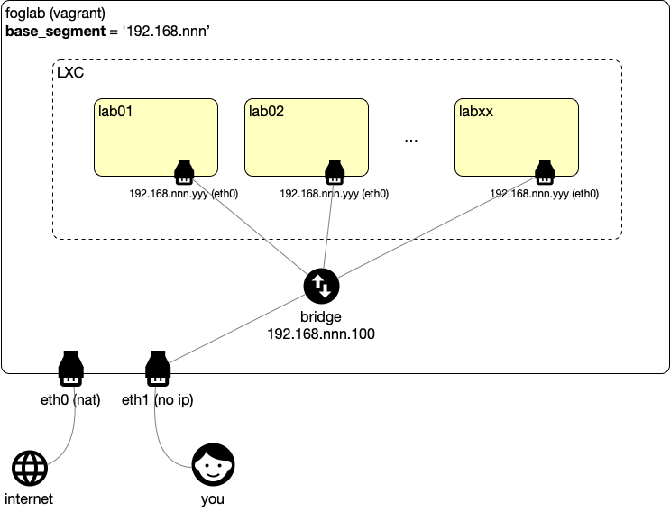

## Foglab is...
Foglab uses a combination of technologies like LXD, Terraform and Ansible to provide a local "cloud" lab ("fog" = low cloud). You can use Foglab to create multiple machines (LXD + Terraform) as well as automating the provisioning of those machines (Ansible).

## Architecture


## Using foglab
1. Install `vagrant` and `virtualbox`
1. Create a `Vagrantfile` like below:

    ```
    Vagrant.configure("2") do |config|
        config.vm.box = "moondly/foglab"
        config.vm.provider "virtualbox" do |v|
            v.memory = 2048
            v.cpus = 2
        end
    end
    ```

    You can adapt the `cpu` and `memory` accordingly. If the values are too low you may have performance issues. Recommended values are `4 cpus` and `8192 MB`.

    By default, foglab will use `192.168.55` as the base segment and your lab vms will receive IPs from the range `<foglab_baseip>.101-254`. 
    
    To use another value:
    ```
    export FOGLAB_BASEIP=192.168.11
    ```
    NOTE: make sure this value does not overlap with any other local network!

1. Start and login:
    ```
    vagrant up
    vagrant ssh
    ``` 
You are now ready to start creating your own labs in foglab!

### Managing `foglab`
#### To pause/resume foglab
```
vagrant suspend
vagrant up
```

#### To destroy foglab
```
vagrant destroy
```

### Managing `labs`
#### Make sure you are inside foglab. If not:
```
vagrant ssh
```
#### Add your ssh public key
```
fogctl sshkey

Please enter the ssh public key to use: <type you ssh public key>
```

#### Deploy a lab with 2 machines
1. Create a folder to contain your lab
    ```
    mkdir mylab
    ```
1. You need to be inside your lab folder to manage the lab
    ```
    cd mylab
    ```
1. Create the vms
    ```
    fogctl vm -n 2 -a
    
    # >> Check the changes and type "yes" when requested
    
    Apply complete! Resources: 2 added, 0 changed, 0 destroyed.
    ```
    This will create a file called `lab.tf` used by terraform to deploy the machines. Type `fogctl vm -h` to check all options. 
    
    NOTE: The machine names are defined after the folder name like: `<labname>[01-99]`. Ex: mylab01, mylab02, ...
1. List the current machine status:
    ```
    fogctl vm -l
    ```
You can manually edit the `lab.tf` file and apply using `fogctl vm -a`
#### Change the number of vms but do not apply automatically
1. Make sure you are inside your lab:
    ```
    cd mylab
    ```
1. Change the config but do not apply. Use -f to force the change (lab.tf already exists at this point):
    ```
    fogctl vm -n 3 -f
    ```
1. When you are ready, apply the changes:
    ```
    fogctl vm -a

    # >> Check the changes and type "yes" when requested

    Apply complete! Resources: 1 added, 0 changed, 0 destroyed.
    ```

#### Snapshots
It is always a good itde to save snapshots from your lab so you can go back in time if something goes wrong.
1. Make sure you are inside your lab:
    ```
    cd mylab
    ```
* To create a snapshot:
    ```
    fogctl snapshot create --label snap1

    Snapshot for vm 'mylab01' created with label 'snap1' at '2019-10-05T21:44:53Z'
    Snapshot for vm 'mylab02' created with label 'snap1' at '2019-10-05T21:44:54Z'
    ```
* To list a snapshot:
    ```
    fogctl snapshot list

    Snapshots for 'mylab01':
      'snap1' : '2019-10-05T21:44:53Z'
    Snapshots for 'mylab02':
      'snap1' : '2019-10-05T21:44:54Z'
    ```
* To restore a snapshot:
    ```
    fogctl snapshot restore --label snap1

    Vm 'mylab01' restored to snapshot with label 'snap1'
    Vm 'mylab02' restored to snapshot with label 'snap1'
    ```
Check `fogctl snapshot -h` for more options.
#### Destroy the lab
1. Make sure you are inside your lab:
    ```
    cd mylab
    ```
1. Destroy the lab:
    ```
    fogctl vm --destroy

    # >> Check the changes and type "yes" when requested
    ```

#### Connect from you local terminal to the vms

1. Get the IPs for your machines
    ```
    fogctl vm -l
    ```
1. If you used your own ssh public key, from your `local terminal` type:
    ```
    ssh root@<ip> 
    ```
1. If not, you can connect from foglab using the `vagrant` user:
    ```
    vagrant ssh 
    
    ssh root@<ip>
    ```
#### DNS names
When a new vm is created, it is registered in foglab dns and can be accessed using `<name>.lab`
```
vagrant ssh

ping <name>.lab
```

# For Developers
## Building a local vagrant basebox
To build a vagrant basebox do:
1. You will need `VirtualBox`, `Vagrant`, `Packer` and `make` installed
1. Clone the git repo locally
1. Build the image, add to Vagrant and test:
    ```
    make
    make add
    make test
    ```
1. Bring up a the dev image built:
    ```
    vagrant up
    ```
1. To remove all created artifacts (images, vagrant boxes, etc):
    ```
    make clean
    ```
The following directories will be mapped during development:
* folder `localActions/` mapped to: `/opt/foglab/localActions`
* folder `scripts/` mapped to: `/opt/foglab/scripts`
* folder `examples/` mapped to: `/opt/foglab/examples`
* folder `test/` mapped to: `/opt/foglab/test`

During the image build, the content of the directories are copied to the respective folders inside the image.

